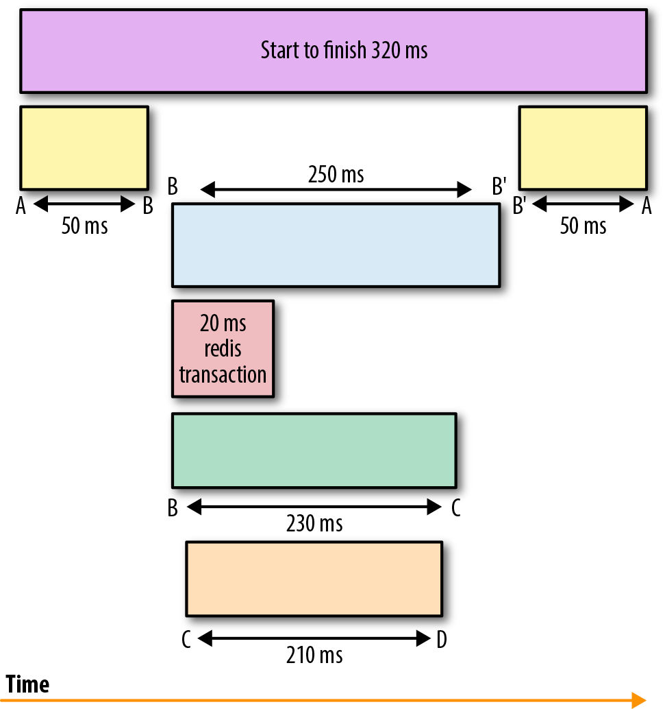
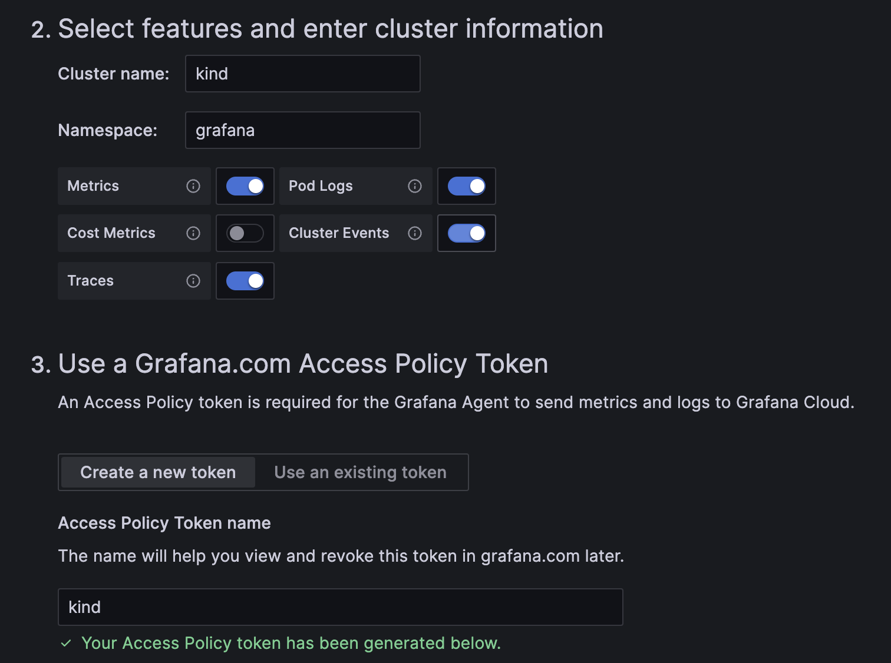

# DIIAGE Monitoring tutorial

> La fiabilité est la fonctionalité la plus importante de n'importe quel système - Google's SRE Book


## The 3 pillars of Observability

Les `logs`, `metrics` et `traces` sont souvent décrites comme les 3 piliers de l'observabilité. Bien que les avoir ne signifie
pas nécessairement avoir un système plus facile a observer, ce sont des outils qui, ils aident a construire
un système plus fiable mais aussi de pouvoir debugger ses   application.

## Logs

> Un `log` est un evenement immutable, qui a une datation (timestamp) et qui decrit un evenement qui s'est produit dans le temps.

Les logs peuvent prendre plusieurs formats:

1. `plaintext` qui est un format texte simple, c'est le format le plus commun
2. `structuré` qui le format qui est a prioriser et compte comme une bonne pratique. La plupart du temps ces logs sont au format `JSON`
3. `binaire` comme les `binlogs mysql`, ou les logs emits par des technologies comme `protobuf`

Les `logs` sont principalement a utiliser pour des cas de debugs. Ils permettent de gagner du contexter sur l'ensemble de nos requetes et pouvoir
mettre en lumiere des problématiques qui ne seraient pas remontées par les 2 autres outils.

### 👍
- Faciles a générer (il suffit de print un string ou un object JSON)
- La plupart des applications, frameworks, ... viennent avec des logs ou des librairies de logs
- Tres performant quand on a besoin d'information granulaire avec beaucoup de contexte (tant que le log est bien localise)

### 👎
- Trop de logging = perte de performance (en fonction des librairies)
- En fonction de la methode de distribution des logs, ils peuvent devenir inutiles
- En grand nombre les logs sont un challenge a ingerer pour les team ops (l'outils le plus utilise est la stack ELK: ElasticSearch + Kibana + Logstash)


## Metrics

> Les `metrics` sont une representation immutable d'une donnée mesurée sur un intervalle de temps. Elle permettent l'utilisation d'outils
mathematiques et de prediction pour en deduire le comportement d'un système.

Contrairement aux logs, les metrics sont optimisees pour pouvoir etre stockées, traitées et retrouvées rapidement, ce qui permet une plus grande retention.
C'est donc un sujet de choix pour pouvoir construire des `dashboards` qui donnent la performance, l'etat de l'application, etc.

### Structure d'une metric

La plupart des metrics sont composees des elements suivants:
- Un nom
- Un timestamp
- Des labels (clef-valeur)
- Une valeur

### Type de metrics

Les 3 types les plus connus sont:

`Counter`:
- Utilise pour representer une data qui s'incremente de maniere monotone (eg: Nombre de requetes, Creation d'un client, ...)
- Sa valeur ne devrait qu'augmenter ou etre reset a 0

`Gauge`:
- Utilise pour representer une valeur numerique qui peut arbitrairement monter ou descendre (eg: La temperature, La vitesse, ...)
- Peut etre utilise pour un `count` qui doit etre decroissant (eg: Nombre de requetes en parallele)

`Histogram`:
- Utilise pour representer un echantillon de valeurs distribue dans des `buckets` (eg: percentiles de latence des requetes)
- Un histogram emet en plus des data, la somme de toutes les valeurs observees, le compte d'evenements observes


A noter: certaines librairies implement d'autres types comme le `UpAndDownCounter`

### 👍

- Stockage et processing facilite par rapport aux logs
- Le cout n'augmente pas avec le traffic (contrairement aux logs)
- Plus malleable que les logs, permet d'utiliser des fonctions mathematiques (eg: Aggregation, correlation, etc)

### 👎

- Comme les logs, les metrics sont scopees a un system en particulier. Rendant le debug difficile dans le cas d'une application
distribuee


## Traces

> Une trace est une representation d'une serie d'evenements qui permettent d'encoder le flow complet d'une requete dans un systeme

Les traces sont une representation des `logs`, leur structure de donne se ressemble enormement. Une trace permet l'evaluation
du path complet d'une requete dans un systeme ainsi que la structure de la requete. Pour fonctionner, **les differents services doivent
garder une forme de contexte entre les requetes**. Ce contexte est le plus souvent un `request ID` passe de requete en requete.

Exemple de system avec les traces associees:



### 👍

- Donne une visibilite complete du système

### 👎

- Challenging a mettre en place pour l'ensemble d'un infrastructure
- Si il manque des traces, cela peut rendre le debugging encore plus difficile (mieux vaut pas de traces que pas assez)
- Difficile d'instrumenter des applications que l'on ne controle pas (eg: DB, applications d'une autre equipe, ...)


## Nodejs + Grafana cloud workshop

## Create the base infrastructure

Create a `kind` cluster

Create an account on grafana cloud and go to your
```
https://<your_grafana_cloud_instance>/a/grafana-k8s-app/configuration/cluster-config
```

and use the following configuration (you'll need to generate a new token)



This will give you a `helm` command like so :

```
helm repo add grafana https://grafana.github.io/helm-charts &&
  helm repo update &&
  helm upgrade --install grafana-k8s-monitoring grafana/k8s-monitoring \
    --namespace "grafana" --create-namespace --values - <<EOF
cluster:
  name: kind
externalServices:
  prometheus:
    host: https://prometheus-prod-24-prod-eu-west-2.grafana.net
    basicAuth:
      username: <your_user>
      password: <your_token>
  loki:
    host: https://logs-prod-012.grafana.net
    basicAuth:
      username: <your_user>
      password: <your_token>
  tempo:
    host: https://tempo-prod-10-prod-eu-west-2.grafana.net:443
    basicAuth:
      username: <your_user>
      password: <your_token>
metrics:
  cost:
    enabled: false
opencost:
  enabled: false
traces:
  enabled: true
grafana-agent:
  agent:
    extraPorts:
      - name: otlp-grpc
        port: 4317
        targetPort: 4317
        protocol: TCP
      - name: otlp-http
        port: 4318
        targetPort: 4318
        protocol: TCP
EOF
```